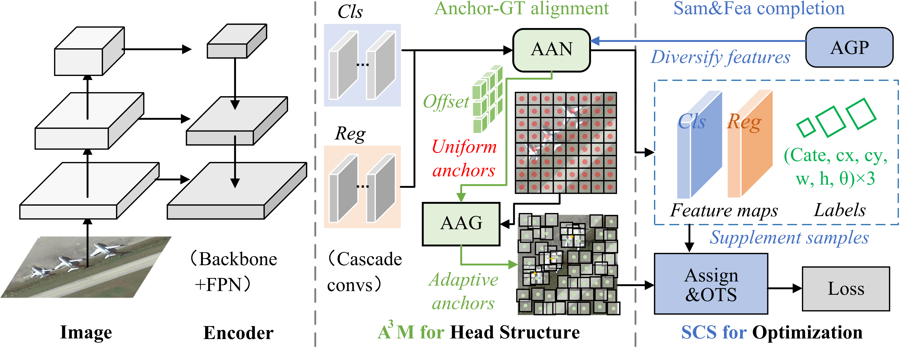

## The offical PyTorch code for paper 
[""Align and Complete Samples in Remote Sensing Fine-grained Rigid Object Detection"", TGRS 2025.](https://ieeexplore.ieee.org/document/11262186)

##### Author: Zicong Zhu


<a href="https://pypi.org/project/mitype/"></a>

```bash
#### News:
#### 2025.11.20: The paper is published on IEEE TGRS!
#### 2025.12.05: code of ACDet is coming soon...
```

## INTRODUCTION

we propose an efficient aligning and completing detector (ACDet) based on a single-stage structure.

It is dedicated to accurately locating and correctly classifying fine-grained rigid objects that are densely arranged and arbitrarily oriented.

##
## ACDet
### Network Architecture

<div align="center">
  
</div>

Architecture of the proposed ACDet during the training process. 
The image is first input into the encoder to extract multiscale features. 
In the head structure, the A3M and AGP mechanisms are applied to decode the multiscale features and generate adaptive anchors. 
In the optimization process, the extracted features, adaptive APs, and GT labels are fed into the sample assignment process with OTS to obtain the final positive samples. 
Finally, the loss function is calculated based on the positive and negative sample distribution and the GT labels to optimize the ACDet.

### Installation

```shell
CUDA >= 9.2
GCC >= 5
Python == 3.8
PyTorch == 1.13.0
mmcv-full
mmdet
mmrotate
```

### training, testing, and inferencing

follow the official mmrotate framework to train and test ACDet. 

## Citation
If you feel this code helpful or use this code or dataset, please cite it as
```

@ARTICLE{11262186,
  author={Zhu, Zicong and Kang, Jian and Diao, Wenhui and Wang, Bing and Ni, Jingen},
  journal={IEEE Transactions on Geoscience and Remote Sensing}, 
  title={Align and Complete Samples in Remote Sensing Fine-grained Rigid Object Detection}, 
  year={2025},
  volume={},
  number={},
  pages={1-1},
  keywords={Feature extraction;Location awareness;Computational modeling;Adaptation models;Heavily-tailed distribution;Telecommunication traffic;Object detection;Detectors;Communication switching;Training;Rigid object;Object detection;Fine-grained recognition;Localization alignment;Long-tail distribution;Feature diversification},
  doi={10.1109/TGRS.2025.3635340}}

```
